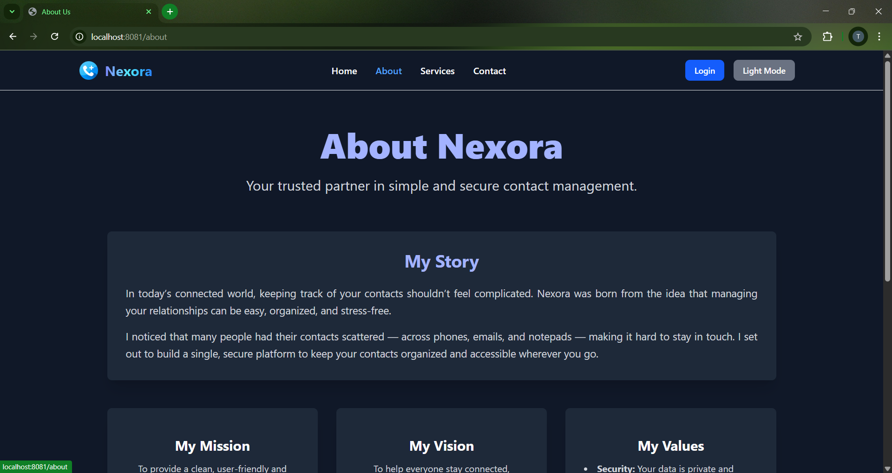

# Nexora – Smart Contact Manager

Nexora is a **Java Spring Boot Full Stack Web Application** for managing personal contacts. It features user authentication, Google OAuth2 login, and dynamic user dashboards built with **HTML**, **JS**, **Thymeleaf** and **Tailwind CSS**.

---

## 🚀 Features

- User Signup, Login, Logout
- Google OAuth2 Authentication
- Create, Edit, Delete Contacts
- Contact Search by Name, Phone, Email
- Contact List Pagination
- Light/Dark Mode with Tailwind
- Add Contact form with direct database insertion
- Spring Security Integration
- MySQL Database with JPA & Hibernate
- Real-time Form Validation
  

---

## 🖼️ Screenshots

### 🏠 Home & Main Pages

| Page | Screenshot |
|------|------------|
| Home |  |
| About |  |
| Contact Us |  |
| Services |  |
| OAuth Login |  |
| Signup |  |
| Dashboard |  |
| Profile |  |
| Profile - Mobile View |  |
| Profile - Light Mode |  |
| Add Contact |  |
| Sidebar |  |
| Navbar Profile Dropdown | .png) |
| MoblieView Dropdown |  |


---

### 📇 Contact Management

| Page | Screenshot |
|------|------------|
| Contact List |  |
| Contact List (NextPage) |  |
| View Contact |  |
| Update Contact |  |
| Search by Name |  |
| Search by Phone |  |
| Search by Email |  |

---

## Tech Stack

| Layer         | Technology                  |
|---------------|-----------------------------|
| Backend       | Java 21, Spring Boot 3.5    |
| Frontend      | Thymeleaf, Tailwind CSS     |
| Database      | MySQL                       |
| Authentication| Spring Security + OAuth2    |
| Build Tool    | Maven                       |

---
## 🔄 Pagination

The contact list supports pagination using Spring Data JPA.  
Each page shows a limited number of contacts with controls to navigate between pages, improving performance and user experience.

---
## Project Structure

``` 
nexora2.0/
├── src/
│   ├── main/
│   │   ├── java/
│   │   │   └── com/
│   │   │       └── nexora/
│   │   │           ├── config/          # Spring Security & App Config
│   │   │           ├── controller/      # Spring MVC Controllers
│   │   │           ├── entities/        # JPA Entity Classes
│   │   │           ├── forms/           # Form Binding Classes
│   │   │           ├── helper/          # Utility & Helper Classes
│   │   │           ├── repositories/    # Spring Data JPA Repositories
│   │   │           ├── services/        # Service Interfaces
│   │   │           ├── serviceImpl/     # Service Implementations
│   │   │           └── Application.java # Main Spring Boot Application
│   │   └── resources/
│   │       ├── static/
│   │       │   ├── css/
│   │       │   ├── js/
│   │       │   └── images/
│   │       ├── templates/               # Thymeleaf Templates
│   │       ├── application.properties   # Main Config File
│   │       └── application-sample.properties
│   └── test/                            # Test Classes
├── pom.xml                              # Maven Build Configuration
└── README.md                            # Project Documentation
```
---
## 🛠️ How to Run the Project

1. **Clone the Repository**
   ```bash
   git clone https://github.com/your-username/nexora2.0.git
   cd nexora2.0
   ```

2. **Configure Application Properties**
   ```bash
   cp src/main/resources/application-sample.properties src/main/resources/application.properties
   ```
   > Edit the copied file and set your MySQL credentials & Google OAuth2 values.

3. **Set Up MySQL Database**
   - Create a database named `nexora20` in MySQL.
   - Spring Boot will auto-generate the schema on app startup.

4. **Build and Run**
   ```bash
   ./mvnw spring-boot:run
   ```
   Or run `Application.java` via your IDE.

5. **Open in Browser**
   ```
   http://localhost:8081/
   ```

## 🤝 Contributing

Contributions are welcome!  
Fork the repo, make changes, and submit a pull request.

---


